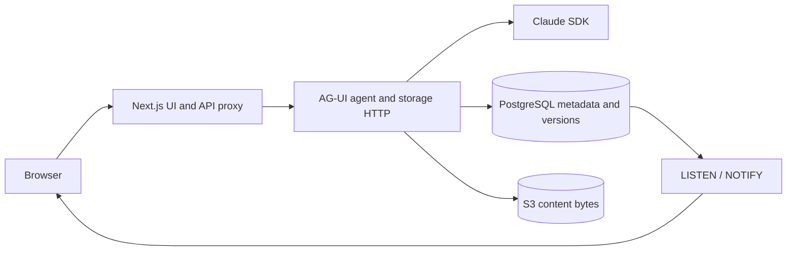

# Architecture

The browser renders a Next.js workspace. CopilotKit's runtime route connects to
an AG-UI agent on port 8000; `agent/src/server.ts` streams the Claude SDK adapter.
The agent also hosts storage HTTP routes and per-user file/node/experiment tools.
`src/lib/agent-proxy.ts` forwards storage requests and attaches a signed identity
when login is enabled. Browser state and authenticated storage access meet in
`src/components/workspace/store.tsx`; pane commands live in `workbench.tsx`.

The frontend and agent have separate manifests and lockfiles. `npm ci` at the
root installs both. The starter's charts, meeting picker and A2UI examples remain
under `src/app/declarative-generative-ui` and `src/hooks`; they are separate from
the knowledge workspace's persistence responsibilities.

### Workbench contract

Everything that moves panes goes through one typed API, `useWorkbench()`
(`src/components/workspace/workbench.tsx`): title bar buttons, the icon rail, the phone pane
switcher, file references in answers, and Claude's open-file tools.

| Part | Does |
| --- | --- |
| `panes.isOpen / show / hide / toggle(pane)` | `"explorer"`, `"editor"` or `"chat"`; on phones `show` switches to that pane |
| `panes.resize / resetSize(pane, width)` | splitter drags, clamped to each pane's range |
| `sidebar.select / show(view)` | the icon rail (`select` on the active view collapses the panel) |
| `editor.open(path, lines?)` | opens a file or the task board, optionally at cited lines |
| `chat.newThread() / focus()` | starts an empty conversation / puts the cursor in the chat |
| `notify(message, level)` | a short notice in the corner |

The layout itself is plain data changed by a reducer (`layout.ts`), so its rules are unit
tested (`tests/unit/workbench.spec.ts`), and a test fails if anything outside the workbench starts
keeping its own pane state.

### File references in answers

Claude's answers can point at a file, or at lines in it, and a click opens them in the middle
pane. A reference is a plain Markdown link to the workspace path, with a GitHub-style line
fragment (the format Claude Code uses in IDEs):

| Claude writes | A click opens |
| --- | --- |
| `[welcome.md](notes/welcome.md)` | the file |
| `[welcome.md:12](notes/welcome.md#L12)` | the file at line 12 |
| `[welcome.md:12-18](notes/welcome.md#L12-L18)` | the file at lines 12–18 |

Paths are relative to the workspace root; lines are 1-based and inclusive. The preview
highlights the paragraphs, list items, table rows or code blocks the lines belong to, and the
editor selects the lines themselves. Links to files that aren't in the workspace show greyed
out, and web links work as before.

Claude learns the format from the system prompt (`agent/src/agent.ts`), and file content
reaches it with numbered lines (the open file in context, and `readWorkspaceFile`), so it can
cite them. The contract lives in `src/components/workspace/file-refs.ts`, whose parser also
accepts `#L12-18` and `notes/welcome.md:12`.

## File storage

Workspace files can live in Postgres + an S3-compatible object store instead of
the browser (plan and next steps: issue #4). It is optional; without
`DATABASE_URL` the app runs as before.

For local setup, see [Development](development.md).

- **Postgres** (15 or newer) holds the file tree, every version of every file, and who
  wrote it (`agent/src/storage/migrations`). Migrations run when the agent starts.
- **Object store** holds the bytes, keyed by their sha256, so identical content is
  stored once and old versions stay readable. Any S3-compatible store works:
  SeaweedFS or Garage self-hosted, or AWS S3, Cloudflare R2, Backblaze B2.
- **API**: the agent server serves `/files` and Next.js forwards `/api/files/*` to it.
  `GET /api/files` lists files, `GET|PUT|DELETE /api/files/<path>` reads, writes
  (request body = bytes) and deletes one, `?versions` returns its history, and
  `GET /api/files?watch` streams every change as server-sent events (Postgres
  LISTEN/NOTIFY, so it works across processes). Login is optional (see below); keep the agent port private in either mode.
- **Knowledge tree**: files live at the workspace root or in a node of a tree whose levels
  are data (`node_types`, seeded as tech › module › loop › process). Nodes are stored with
  Postgres `ltree`, and the database checks that each node sits exactly one level below its
  parent. Each node has its own files. `GET|POST /api/nodes` lists and adds nodes,
  `GET|PATCH|DELETE /api/nodes/<id>` reads (with its ancestors), renames and deletes one
  (with everything below it), and every `/api/files` route takes `?node=<id>`.
- **Experiments**: anyone who can view a node (usually a process) can fork it into an
  experiment. The experiment gets its own copy of the node's file list, pointing at the same
  stored bytes, and from then on every change, by the user or by Claude, stays in the
  experiment. It records a hypothesis, parameters and results as JSON, so the experiments on
  one node compare side by side. A draft is seen only by its author; shared and archived ones
  by everyone who can view the node; only the author changes it, and an archived one is read
  only until restored. `GET|POST /api/experiments` lists (optionally `?node=<id>`) and
  forks, `GET|PATCH|DELETE /api/experiments/<id>` reads, changes and deletes one, and every
  `/api/files` route takes `?experiment=<id>`. In the Knowledge view, experiments sit under
  their node with their status, and the Experiment tab holds the details and a comparison
  table. Moving an experiment's results into the node comes with proposed edits (step 7 of
  issue #4).
- **Access**: users belong to groups in an org tree (company › dept › team), and a grant
  gives a user or group a role on a node and everything below it, or on the whole
  workspace. Roles are additive: viewer reads; editor also writes and deletes files (a deleted
  file keeps its history) and adds and renames nodes; owner also deletes nodes and manages
  grants. A grant to a group covers members of its sub-groups too.
  The API (`/api/access`: users, groups and members, grants, audit log) and Claude's tools
  check access in one place (`agent/src/storage/session.ts`), and every change is written to
  `audit_log` with who made it and whether Claude made it for them. Without login there is
  one built-in user who owns everything, so nothing changes for a single-user setup.
- **Login** (optional): set `AUTH_SECRET` (the same value for the app and the agent, at least
  32 characters, e.g. `openssl rand -hex 32`) and an OpenID Connect provider (`OIDC_ISSUER`,
  `OIDC_CLIENT_ID`, `OIDC_CLIENT_SECRET` if the client has one; Keycloak, Authentik, Google,
  Entra ID and others work). Register `<APP_URL>/api/auth/callback` as the redirect URI, and
  set `APP_URL` when the app sits behind a proxy. Users then sign in before the workspace
  opens; the app keeps them in a signed cookie and signs each request it forwards to the agent
  (`X-Knowledge-User`, valid for five minutes), so the agent port must stay private. The first
  person to sign in owns the workspace and shares nodes from the title bar's Share button
  (people show up there once they have signed in). Viewers get the files read only, and
  Claude's tools in a chat act as the person chatting.
- **Database-enforced access**: file and node queries made for a user run in Postgres as
  the restricted role `knowledge_user`, with row-level security policies
  (`agent/src/storage/migrations/004_row_security.sql`, and `005_experiments.sql` for
  experiments) that apply the same grants. If a
  check in the app were ever missed, Postgres would still refuse. The migration creates the
  role when the database user may (`CREATEROLE` or superuser, as with `docker compose`);
  otherwise the agent logs that row-level security is off, and an admin can enable it with
  `CREATE ROLE knowledge_user NOLOGIN; GRANT knowledge_user TO <app user>;` before the next
  start.
- **Download links**: set `S3_PUBLIC_URL` to the object store's address as browsers reach it
  (e.g. `http://localhost:8333` with `docker compose`, or `https://s3.<region>.amazonaws.com`)
  and images and other binary files download straight from the store. After the access
  check, the API answers with a redirect to a signed link that works for five minutes.
  Text files are still served by the app, which the editor reads them through.
- **Claude** gets `list_nodes`, `create_node`, `list_files`, `read_file`, `write_file`,
  `list_experiments`, `create_experiment` and `update_experiment` tools on the agent server
  (`agent/src/storage/tools.ts`), so it works with files even when no browser tab is open.
  The file tools take a `node` or an `experiment`; the chat context says where the user is,
  and inside an experiment Claude writes only there. Its writes are versions authored by the
  agent.
- **UI**: on load the workspace checks `/api/files`. If it answers, files load from the
  server, edits save there (debounced), and the change stream brings in Claude's writes and
  edits from other tabs. Without login, the first visit to an empty server uploads this
  browser's files.
  The Knowledge view in the left rail shows the tree; clicking a node moves the workspace
  there (the title bar shows where you are), and each node keeps its own open tabs.
  If it doesn't answer, everything stays in localStorage and the browser-side file tools
  are used instead.
- **Tests**: `npm run test:integration` requires `TEST_DATABASE_URL` and `S3_ENDPOINT`;
  it resets a disposable database. See [Testing](testing.md).

## Boundaries when changing code

Preserve `useWorkspace()` and `useWorkbench()` consumers while extracting internal
logic. Place identifiers distinguish root, node and experiment (`x:<id>`); never
key a pending save only by file path. Navigation must flush the place being left,
and late network responses must not overwrite another place's files. Local edits
and in-flight writes take priority over incoming SSE updates.

Experiments are persisted forks of a node's file list. Workbench runs discussed in
issue #13 describe UI/workflow traversal; they do not replace experiment storage.
Coordinate changes with the feature PR stack before introducing new semantics.
